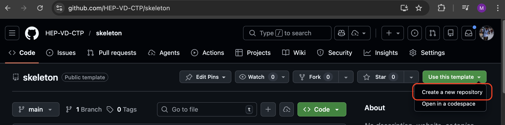
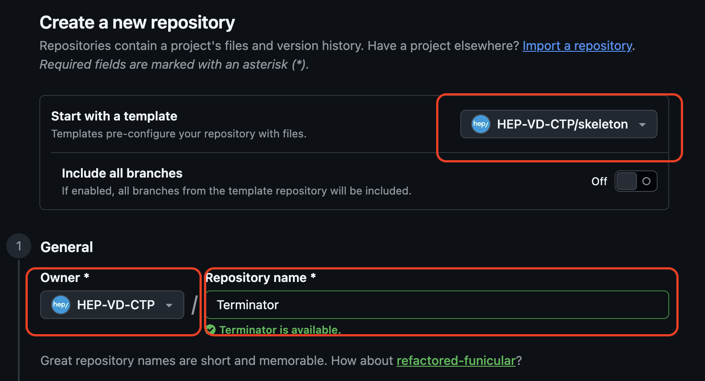

# Guide de démarrage d'un nouveau projet avec Skeleton

Ce guide vous accompagne pas à pas pour créer votre propre application à partir du template **Skeleton**.

---

## Prérequis

Avant de commencer, assurez-vous d'avoir installé les logiciels suivants sur votre machine :

- **Git**
- **Github Desktop**
- **Docker Desktop** 
- **Un éditeur de code** 

---

## Etape 1 : Créer votre projet à partir du template

Sur GitHub, le projet Skeleton est un **template**. Cela signifie que vous pouvez créer une copie indépendante pour votre propre projet.

1. Rendez-vous sur la page du template Skeleton sur GitHub
2. Cliquez sur le bouton vert **"Use this template"** puis **"Create a new repository"**



3. Remplissez les informations de votre nouveau projet :
   - **Owner** (propriétaire) : choisissez votre organisation ou votre compte personnel
   - **Repository name** : le nom de votre projet (par exemple `Terminator`)
   - Laissez le dépôt en **Private** si le projet ne doit pas être public



4. Cliquez sur **"Create repository"**

Votre projet est maintenant disponible à une adresse du type :
`https://github.com/HEP-VD-CTP/Terminator`

---

## Etape 2 : Préparer vos dossiers en local

Avant de télécharger le projet, créez deux dossiers sur votre machine :

- Un dossier pour le **code source** du projet (par exemple `/Users/Marcel/Desktop/git`)
- Un dossier pour les **volumes Docker** qui contiendront les données persistantes comme la base de données (par exemple `/Users/Marcel/Desktop/volumes`)

> **Qu'est-ce qu'un volume Docker ?** C'est un dossier sur votre machine où Docker stocke les données qui doivent persister entre les redémarrages (base de données, fichiers uploadés, etc.). Sans volume, toutes les données seraient perdues à chaque arrêt des conteneurs.

---

## Etape 3 : Cloner le projet en local

**Cloner** signifie télécharger une copie du projet depuis GitHub sur votre machine.

1. Ouvrez un **terminal**
2. Naviguez vers votre dossier de code source et clonez le projet :

```bash
cd /Users/user/Desktop/git
git clone https://github.com/HEP-VD-CTP/Terminator
```

> Remplacez l'URL par celle de **votre** projet (visible sur GitHub en cliquant sur le bouton vert "Code").

Le projet est maintenant copié en local dans un nouveau dossier portant le nom de votre projet.

---

## Etape 4 : Initialiser le projet

Le projet contient un script d'initialisation qui va configurer automatiquement votre environnement. Il va vous poser quelques questions (nom de l'application, organisation, chemin du volume) puis générer les fichiers de configuration nécessaires.

1. Dans le terminal, entrez dans le dossier du projet puis lancez le script :

```bash
cd Terminator
cd documentation
chmod +x init.sh
./init.sh
```

> `chmod +x init.sh` rend le script exécutable. Cette commande n'est nécessaire que la première fois.

2. Le script vous demandera :
   - **Le titre de l'application** : un seul mot, par exemple `Terminator`
   - **Le nom de l'organisation** : par exemple `HEP-VD`
   - **Le chemin vers le volume** : le dossier créé à l'étape 2, par exemple `/Users/Marcel/Desktop/volumes`

3. Le script va ensuite :
   - Créer le dossier volume s'il n'existe pas
   - Générer le fichier `.env` avec vos paramètres
   - Renommer les références internes du projet avec le nom de votre application

---

## Etape 5 : Lancer le projet

Une fois l'initialisation terminée, lancez l'application avec Docker :

```bash
cd ..
docker compose up --build
```

> **Que fait cette commande ?**
> - `docker compose up` démarre tous les services de l'application (backend, frontend, base de données, etc.)
> - `--build` reconstruit les images Docker (nécessaire la première fois ou après une modification des Dockerfiles)
> - Le premier lancement peut prendre plusieurs minutes car Docker doit télécharger et construire les images

Attendez que tous les services soient démarrés (vous verrez les logs défiler dans le terminal).

---

## Etape 6 : Accéder à l'application

Une fois les services lancés, ouvrez votre navigateur et rendez-vous à l'adresse :

**https://localhost:8443/**

> Votre navigateur affichera un avertissement de sécurité car le certificat SSL est auto-signé. C'est normal en développement : cliquez sur "Avancé" puis "Continuer" pour accéder au site.

### Comptes par défaut

Trois comptes sont créés automatiquement (mot de passe : `123456`) :

| Email               | Rôle              |
|---------------------|-------------------|
| `admin@mail.com`    | Administrateur    |
| `teacher@mail.com`  | Enseignant        |
| `student@mail.com`  | Etudiant          |

---

## Commandes utiles

| Commande | Description |
|----------|-------------|
| `docker compose up --build` | Lancer l'application (avec reconstruction) |
| `docker compose up` | Relancer l'application (sans reconstruction) |
| `Ctrl + C` | Arrêter l'application dans le terminal |
| `docker compose down` | Arrêter et supprimer les conteneurs |
| `docker compose logs -f backend` | Voir les logs du backend en temps réel |

---

## En cas de problème

- **"Port already in use"** : un autre programme utilise le même port. Arrêtez-le ou modifiez les ports dans le fichier `.env`.
- **Docker ne démarre pas** : vérifiez que Docker Desktop est bien lancé (icône dans la barre des tâches).
- **Le site ne s'affiche pas** : attendez que tous les services soient prêts dans les logs du terminal avant d'accéder au navigateur.
